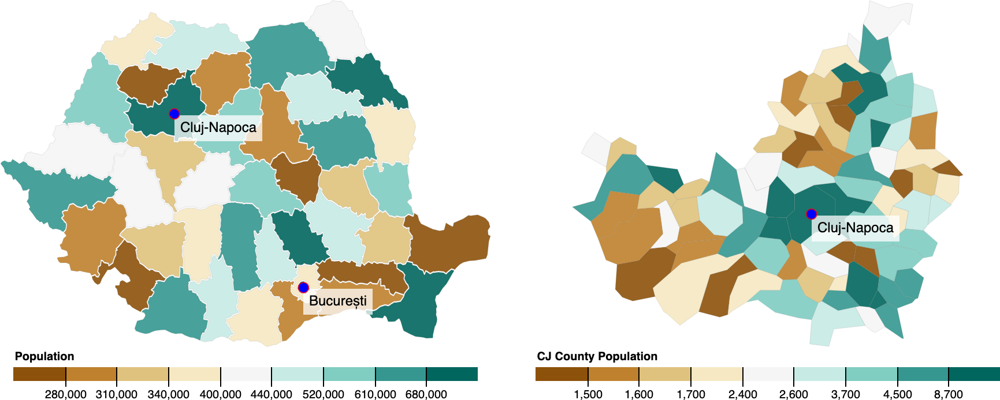

<p>&nbsp;</p>

<p align='center'>
  
  <p align='center'>Responsive maps of Romania's administrative units. Made with React Hooks, Material UI 4 and D3v5.</p>
</p>
<p>&nbsp;</p>

# react-romania

[](https://www.npmjs.com/package/react-romania) [](https://standardjs.com)

## Demo

Check out the demo here: [https://horatiubota.github.io/react-romania/](https://horatiubota.github.io/react-romania/)

## Install

```bash
npm install --save react-romania
```

## Usage

```jsx
import React, { Component } from 'react'
import MapOfRomania from 'react-romania'

function Example()  {
  return (
    <MapOfRomania />
  )
}
```

## License

MIT © [horatiubota](https://github.com/horatiubota)
